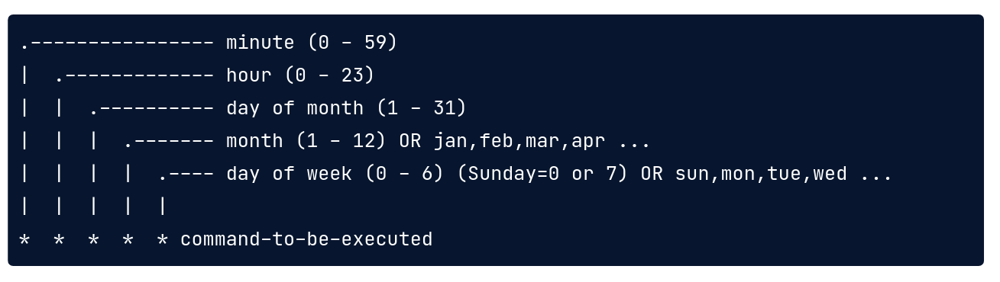
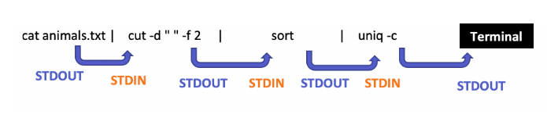

# Help for a command 
```sh
man head   #man command_to_search
```

# History 
```sh
history  # !55 to run 55th command , !head for most recently used head command 
```
# Files and Directories

### Curent Directory
```sh
pwd
```
### list files
```sh
ls  /file/path

ls -R -F /path/    #-R-> recursive shows all files -F -> / after every directory, * after runnable program

la

l
```
pwd - /home/krushna  
/airflow  -> relative path  
/home/krushna/airflow -> absolute path

The shell decides if a path is absolute or relative by looking at its first character: If it begins with /, it is absolute. If it does not begin with /, it is relative.

### Changing Directories
```sh
cd /directory/path
cd /home/krushna/airflow
cd ..     # move to parent directory
cd .      # current directory
cd ~      # home directory
```
### Copying Files
```sh
cp original.txt duplicate.txt
cp file1 file2 /backup 
```

### Move a file
```sh
mv file1.txt file2.txt ..   # moved to one level above 
mv file1.txt /home/krushna/backup/
```

### Rename a file
mv can also be used to rename a file
```sh
mv file.txt old-file.txt
```

### Delete file
```sh
rm file1.txt file2.txt    #removes permanently
```

## Create and Delete directories
rmdir works only when directory is empty
```sh
mkdir direcory_name
rmdir directory_name # must be empty
rm -d directory_name

rm -r directory_name  # will remove nonempty directory
rm -rf directroy_name # will remove without prompting
```

### View files Content
```sh
cat filename.txt

less filename.txt

less fil1.txt file2.txt   #:n next file, :p previous file :q quit

head file.csv   # prints first 10 lines

head -n 5 file.csv   # prints first 5 lines

tail file.csv    # last lines

cut -f 1-5,8 -d , file.csv   #-f fileds -> 2 to 5 columns, and 8 number column -d -> delimeter as comma , 
```
## grep file
grep selects files according to the content
```sh
grep bicuspid file.csv
grep '[pc]' fruits.txt # will return text with p or c
grep -c 'Sydney Carton\|Charles Darnay' two_cities.txt  # count of lines with either of two strings 

cat two_cities.txt | egrep 'Sydney Carton|Charles Darnay' | wc -l # same output as above
```
- -c: print a count of matching lines rather than the lines themselves
- -h: do not print the names of files when searching multiple files
- -i: ignore case (e.g., treat "Regression" and "regression" as matches)
- -l: print the names of files that contain matches, not the matches
- -n: print line numbers for matching lines
- -v: invert the match, i.e., only show lines that don't match

### count records in file
wc - word count  
-c = # of characters  
-w = # of words  
-l = # of lines  
```sh
wc -c file.txt
```
### wildcards to use for filenames

seasonal/*  
seasonal/*.csv  
  
? - matches a single character  
[ ] - matches any of the characters in the square bracket  
{ } - matches any of the comma separated patterns
```sh
head -n 3 seasonal/s*

ls directory1/file*

ls 201?.txt  # 2017.txt, 2018.txt, 2019.txt

ls 201[78].txt  # 2017.txt, 2018.txt

ls {*.csv, *.txt}  # any file with csv or txt
```

### Sorting the data from file
sort - by default asc alphabetical order   
-n = sort numerically  
-r = reverse the order  
-f = fold case i.e case insensitive  
-b = ignore lending blanks

```sh
sort -r file.txt
```
### find a file

```sh
find [directory] -name file.txt

find start_dir/ .csv
```

### Remove duplicate lines from file
uniq - only remove adjacent duplicate lines
```sh
uniq -c file.txt # gives count also
```

### SED command 
sed is streame editor mostly used for find and replace
```sh
sed 's/unix/linux/' file.txt # will replace unix with linux # s = substitution operaton

sed 's/unix/linux/2' geekfile.txt   # replacing 2nd occurence

sed 's/unix/linux/g' geekfile.txt  # replacing all matching occcurences

sed 's/unix/linux/3g' geekfile.txt  # 3rd to all matching occurences

sed '3 s/unix/linux/' geekfile.txt  # replacing only from 3rd line number
```

# Save commands output
">" = overwrite the file  
">>" = append the output

```sh
head -n 5 file.csv > top.csv  #storing first 5 lines to top.csv

cut -d , -f 2 seasonal/*.csv | grep -v Tooth > teeth-only.txt

```

# Combining commands
pipe is used to combine commands
```sh
head -n 5 seasonal/summer.csv | tail -n 3

cut -d , -f 1 seasonal/spring.csv | grep -v Date | head -n 10

cat soccer_scores.csv | cut -d "," -f 2 | tail -n +2 | sort | uniq -c # count # of time team won.. 2nd field is team 
```
using output of the left command as input to the right


# Priting using shell
echo - for printing in shell  
set - gives all veriables which are set
```sh
echo $USER   # prints usre name
echo USER    # prints USER
echo $OSTYPE   
```

**shell variable**


```sh
training=seasonal/summer.csv
echo $training

for filetype in docx odt pdf; do echo $filetype; done

for filename in people/*; do echo $filename; done

files=seasonal/*.csv
for f in $files; do echo $f; done

for file in seasonal/*.csv; do grep 2017-07 $file | tail -n 1;done

for f in seasonal/*.csv; do echo $f; head -n 2 $f | tail -n 1; done
```

# Editing Files using nano

Ctrl + K: delete a line.   
Ctrl + U: un-delete a line.  
Ctrl + O: save the file ('O' stands for 'output'). You will also need to press Enter to confirm the filename!  
Ctrl + X: exit the editor.  
```sh
nano filename.txt
```

# Running bash scripts
```sh
bash filename.sh
```
## Command line arguments
```sh
# inside the file   $@ will be replaced with arguments
sort $@ | uniq

# command line
bash unique-lines.sh seasonal/summer.csv

# we can also use, parameters will be passed on cmd
cut -d , -f $2 $1
```

# Downloading data from command line

## curl
curl - Client for URLs  
download data from HTTPs and FTP
```sh
curl [option flags] [url]

# https://demowebsite.com/file.txt

curl -O url  # -O (capital O)saves file with original name 

curl -o renamed.txt url   # small o to rename the file

curl -O https://demosite.com/datafile*.txt

curl -O https://demosite.com/datafile[001-100].txt  # download 001 to 100 file

curl -O https://demosite.com/datafile[001-100:10].txt # download every 10th file

curl -L -O -C https://demosite.com/datafile[001-100].txt 
```
-L redirects the http URL if 300 error code found   
-C resumes the previous file transfer if it times out before completion

## wget
World Wide Web and Get  
native to linux  
better than curl to download multiple files recursively

-b: background download  
-q: turnoff wget output  
-c: resume broken download

```sh
wget [option flags] [url]

wget -bqc https://demourl.com/filename.txt

# url_list.txt containing URLs

wget -i url_list.txt # if option flags are needed put it before -i

wget --limit-rate=200k -i url.list.txt  #setting download rate

wget --wait=2.5 -i url_list.txt  #wait 2.5 sec before downloading next file
```

**curl advantages** -   
downloading and uploading files from 20+ protocols  
**wget advantages**-   
many builtin functionalities for handling muliple files  
can handle various fil formats

# CRON Jobs
Timebased job scheduler  
used to automate bash scripts, python scripts

**crontab** - central file to keep track of all cron jobs
```sh
crontab -l   # list cron scheduled jobs 
crontab -e   # open crontab for the user and add lines
```
Adding jobs to crontab  
Option 1: modify using text editor  
Option 2: echo the scheduler command to crontab
```sh
echo "* * * * * python create_model.py" | crontab
```
60 sec/ 1 min scheduling possibility



"* "  - always on  
"* * * * *" -> run every minute every hour every day every month and every day of the week i.e run every minute

"15 * * * * " -> run every 15th minute

"*/2 * * * * " -> run every 2 minutes


# Bash Scripting
First line is shebang. It tells interpreter that it is bash script and located at /usr/bash. Can be checked with-  `which bash` 
```sh
#!/usr/bash 
or
#!/bin/bash
```
file extension is **.sh** and run as -
```sh
bash filename.sh

./filename.sh
```
After creating sh we have to give execute permission to the file as - 
```sh
chmod +x file_name.sh
```

## Standard streams
STDIN - stream of data into the program  
STDOUT - stream of data out of the program  
STDERR - errors in program  

/

## arguments
Bash script can take arguments from command line.  
ARGV us th array of arguments.           

```sh
#!/usr/bash
echo $1    # arg 1
echo $2    # arg 2
echo $@    # gives all arguments same as $*
echo "There are" $# "arguments"    # gives number of arguments

########
> bash abovefile.sh Krushna Borkar 123 123

#output
Krushna
Borkar
Krushna Borkar 123 123
There are 4 arguments
```

```sh
cat hire_data/* | grep "$1" > "$1".csv

> bash file.sh Pune
```
